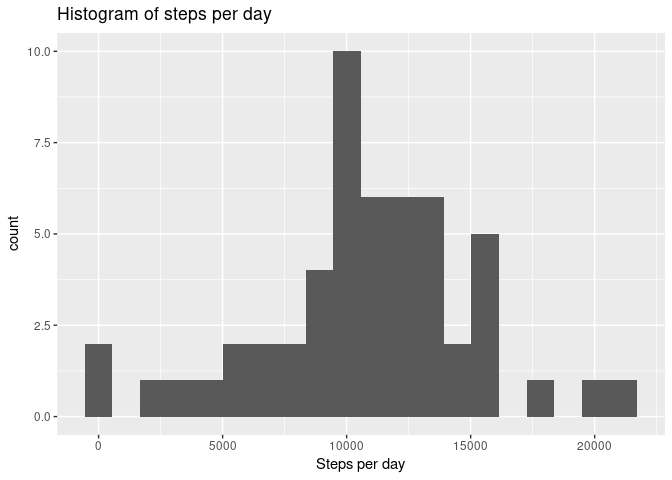
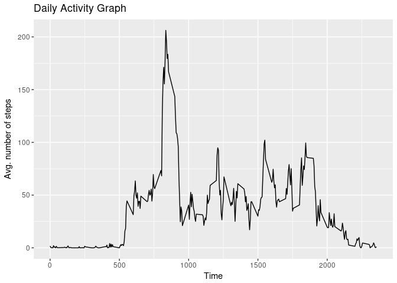
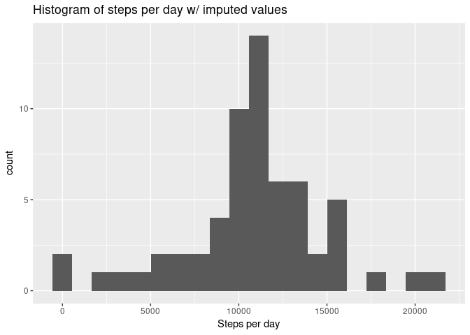
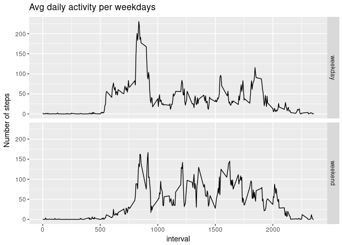

# Reproducible Research: Peer Assessment 1


## Loading and preprocessing the data

Unzip the data file into a temporary directory, then read the data frame, while converting *date* column into Date class (NA means default conversion in colClasses).


```r
tmp <- tempdir()
unzip('./activity.zip', exdir = tmp)
df <- read.csv(file.path(tmp, 'activity.csv'), colClasses = c(NA, 'Date', NA))
```

## What is mean total number of steps taken per day?

Exclude NA values from the data frame, then aggregate the obtained data frame by date and plot histogram of total steps per day.


```r
library(ggplot2)
dfDef <- subset(df, !is.na(steps))
stepsPerDay <- aggregate(x = dfDef$steps, by = list(date = dfDef$date), FUN = sum)
qplot(stepsPerDay$x, bins = 20, xlab = 'Steps per day', main = 'Histogram of steps per day')
```

<!-- -->

Let's calculate mean and median of total steps per day.


```r
# 
meanStepsPerDay <- mean(stepsPerDay$x)
medianStepsPerDay <- median(stepsPerDay$x)
```

The mean of total steps per day is 1.0766189\times 10^{4} and the median of total steps per day is 10765.


## What is the average daily activity pattern?

Let's aggregate by interval and create a time series plot of average daily activity.


```r
avgDailyActivity <- aggregate(x = dfDef$steps, by = list(interval = dfDef$interval), FUN = mean)
qplot(interval, x, 
      data = avgDailyActivity, 
      xlab = 'Time', ylab = 'Avg. number of steps', main = 'Daily Activity Graph', geom = 'line')
```

<!-- -->

The interval with maximum number of steps


```r
avgDailyActivity[avgDailyActivity$x == max(avgDailyActivity$x),]$interval
```

```
## [1] 835
```

We see that the peak of daily activity is in the morning, at 8:35 am.


## Imputing missing values

The number of rows with NA in steps column. 


```r
nrow(df[is.na(df$steps),])
```

```
## [1] 2304
```

Note that no rows with NA in date or interval columns.


```r
nrow(df[is.na(df$date),])
```

```
## [1] 0
```

```r
nrow(df[is.na(df$interval),])
```

```
## [1] 0
```

But for example, data for 2012-10-01 contains only NA. 

So, to impute NA values we'd better use averages for daily intervals, as daily averages not always can be defined.


```r
avgSteps <- avgDailyActivity$x
names(avgSteps) <- avgDailyActivity$interval

dfFilled <- data.frame(df)
for (i in 1:nrow(df)) {
    if (is.na(df[i, 'steps'])) {
        dfFilled[i, 'steps'] <- avgSteps[[as.character(df[i, 'interval'])]]
    }
}
```

Let's make the same histogram as above but for the data frame with imputed values.


```r
stepsPerDayImp <- aggregate(x = dfFilled$steps, by = list(date = dfFilled$date), FUN = sum)
qplot(stepsPerDayImp$x, bins = 20, xlab = 'Steps per day', main = 'Histogram of steps per day w/ imputed values')
```

<!-- -->

```r
meanStepsPerDayImp <- mean(stepsPerDayImp$x)
medianStepsPerDayImp <- median(stepsPerDayImp$x)
```

Let's compare mean and median for original and imputed data frames.


```r
meanStepsPerDayImp == meanStepsPerDay
```

```
## [1] TRUE
```

```r
medianStepsPerDayImp == medianStepsPerDay
```

```
## [1] FALSE
```

So the mean is the same for original and imputed data, and medians are different.

The median for the imputed values 1.0766189\times 10^{4}, the median for the data with NA ignored 10765, the diffence of the medians is 1.1886792.


## Are there differences in activity patterns between weekdays and weekends?

We can easily see the difference in the daily activity from the plot below.


```r
dfFilled$wd <- weekdays(dfFilled$date, abbreviate = TRUE)
dfFilled$day <- rep('weekday')
dfFilled[dfFilled$wd %in% c('Sat', 'Sun'), ]$day <- rep('weekend')
dfFilled$day <- as.factor(dfFilled$day)
avgDailyActivityPerDayType <- aggregate(x = dfFilled$steps, by = list(day = dfFilled$day, interval = dfFilled$interval),  mean)
qplot(interval, x, data = avgDailyActivityPerDayType, facets = day ~ ., geom = 'line', xlab = 'interval', ylab = 'Number of steps', main = 'Avg daily activity per weekdays')
```

<!-- -->

